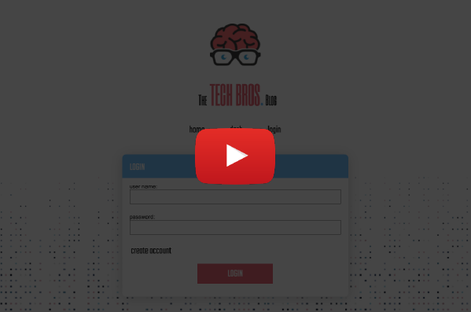
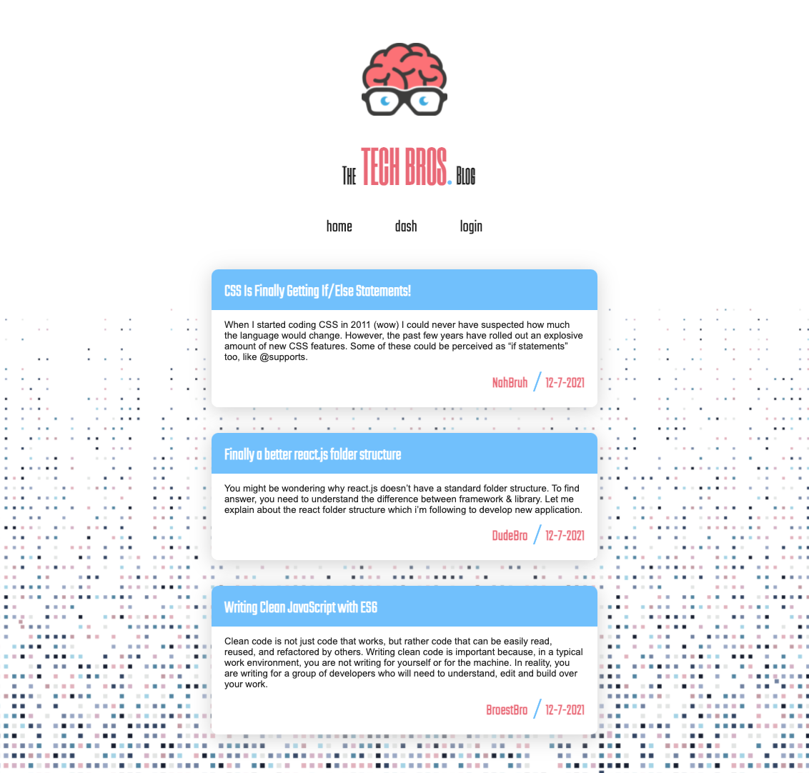

# the-tech-bros-blog

<br />

## Table of Contents

- [Description](#description)
- [User Story](#user-story)
- [Installation](#installation)
- [Deployment](#deployment)
- [License](#license)
- [Demo](#demo)
- [Criteria](#criteria)
- [Collaboration](#collaboration)

<br />
<br />

## Description

📝

The Tech Bros Blog is a CMS-style blog site where developers can publish their posts on topics related to technological concepts, recent advancements, and new technologies; and can comment on other developers' posts as well.

<br />
<br />

## User Story

```
AS A developer who writes about tech
I WANT a CMS-style blog site
SO THAT I can publish articles, blog posts, and my thoughts and opinions
```

<br />

## Installation

⬇️

Must first launch mySQL server with the following commands:

```
mysql -u root
source db/schema.sql
quit

```

<br />

Application will then run in the command-line with:

```
node seeds
node server
```

<br />
<br />

## Deployment

**Visit The Tech Bros Blog on Heroku:**

[](https://the-tech-bros-blog.herokuapp.com/)

<br />
<br />

**Employing the following technology:**

[](https://www.npmjs.com/package/nodejs-mvc) [](https://www.npmjs.com/package/express-handlebars) [](https://www.npmjs.com/package/mysql2)

[](https://www.npmjs.com/package/sequelize) [](https://www.npmjs.com/package/connect-session-sequelize) [](https://www.npmjs.com/package/express-session)

[](https://www.npmjs.com/package/dotenv) [](https://www.npmjs.com/package/bcrypt)

<br />
<br />

## License

Copyright (c) David Dyer [2021]

[](https://choosealicense.com/licenses/isc/)

<br />

## Demo

[](https://youtu.be/aanCqTP4oxg)



<br />
<br />

## Criteria

✅

```
When visiting the site for the first time, the user is presented with
a homepage, including any existing blog posts title and date.

Navigation links include home, dashboard, and the option to login.

When clicking the dashboard, the user is given the option to login or sign-up.

When choosing to sign-up, the user is prompted to create a username
and password.

New user credentials are saved, and returning users must re-enter user
name and password.

After logging in, the navigation will include an option to logout.

When clicking on any blog post, the user is presented with the title,
contents, creator name, date, and the option to leave a comment.

When entering a comment and clicking submit while logged in, the comment
is saved, and the post updated to display commentor name, date created.

When clicking Dashboard, the user is presented with any posts they've
created, and the option to add new post.

When selecting to add new post, the user is prompted to enter both a
title and contents.

When clicking on the create button, the new post is saved and the user
is taken back to their updated dashboard.

When clicking on any existing post in dashboard, user has option to
update or delete.

If user is idol for a set time, user is still able to view comments, but
must login again before being able to add, update, or delete comments.

When opting to logout, the user is signed out of the site.

```

<br />
<br />

## Collaboration

Development efforts most often include guidance from Jedi Master:
**Chris Champness**

<a href= "https://github.com/CChampness"></a>

**Reporting issues**:
Contact [djdyer](https://www.github.com/djdyer) to report bugs.

**Contributions**:
Clone branch, submit pull request for review after completing any improvements.

<br />
<br />
<br />
Thanks for taking a look!

🤓
